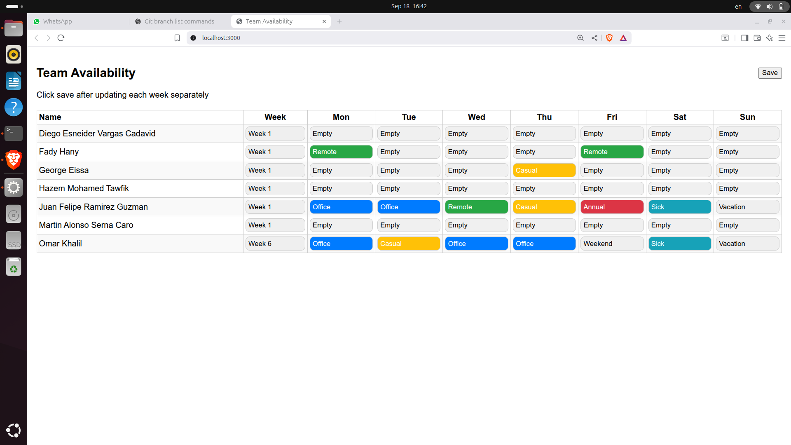
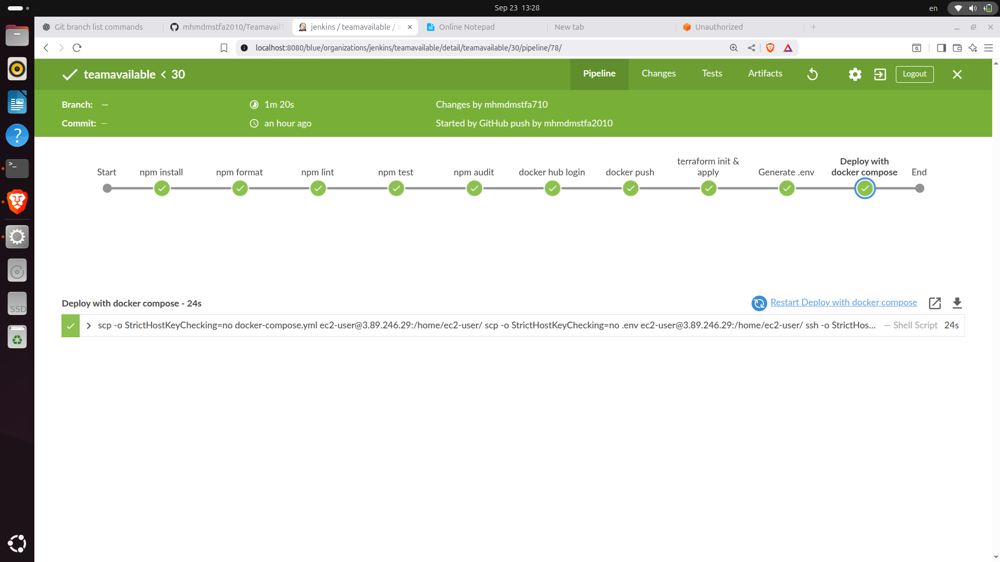
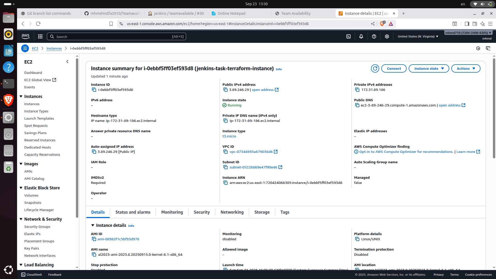
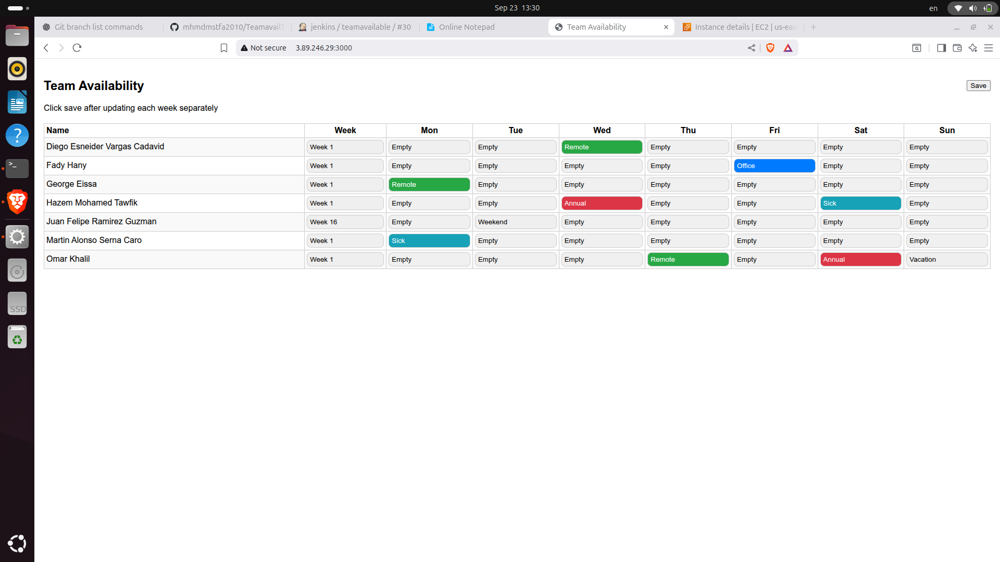
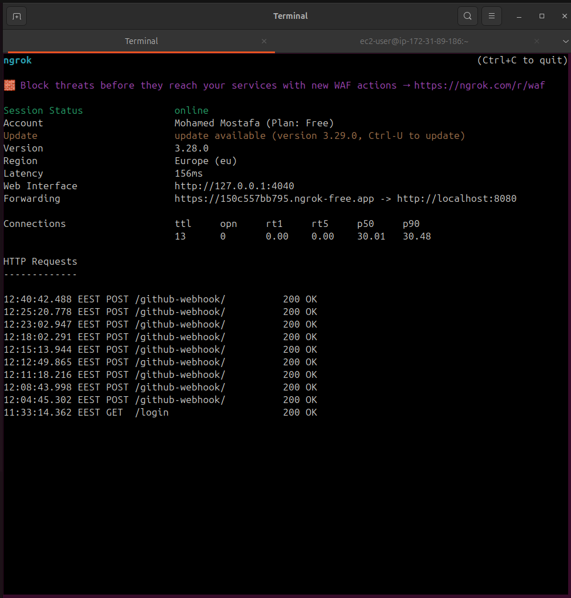

# Team Availability Tracker - CI/CD

## Project Phases

- Phase 1: Local CI pipeline using `ci.sh` to build, test, dockerize, and run the stack locally with Docker Compose.
- Phase 2: Jenkins declarative pipeline that builds, pushes the image, provisions infra with Terraform, and deploys on AWS EC2.

## Prerequisites

- Docker and Docker Compose (Docker CLI v20+ with `docker compose`)
- Node.js (optional if you only use Docker)
- For Phase 2 (Jenkins on AWS):
  - Jenkins with credentials configured:
    - `DockerHub_cred` (Username/Password)
    - `AWS_Creds` (AWS access key credentials)
    - `AWS_SSH` (SSH key for EC2 via Jenkins SSH Agent)
    - `REDIS_PASSWORD` (Secret text)
  - AWS S3 bucket `jenkins-task-terraform-state` and DynamoDB table `jenkins-task-terraform-lock` exist for Terraform backend
  - An existing EC2 key pair name matching `key_name` in `terraform/terraform.tfvars`

## Environment

Create a `.env` file (Compose reads it automatically):

```
REDIS_HOST=redis
REDIS_PORT=6379
REDIS_PASSWORD=changeme
```

## Phase 1: Run Locally with `ci.sh`

```
bash ci.sh
```

The script will:

- Install dependencies
- Format, lint, and test the app
- Run an npm audit (non-blocking)
- Build the Docker image
- Start services with Docker Compose

Open http://localhost:3000

## Services

- App: http://localhost:3000
- Redis: localhost:6379

## Quick Start (Local)

```
# 1) Create .env (see Environment)
# 2) Run the local CI/CD pipeline
bash ci.sh

# 3) Open the app
xdg-open http://localhost:3000 || open http://localhost:3000 || true
```

To stop services:
```
docker compose down
```

## Healthcheck

- Endpoint: `GET /healthz` returns `{ status: "ok" }`
- Compose uses this endpoint for container health status
- Redis healthcheck: `redis-cli -a "$REDIS_PASSWORD" ping` must return `PONG`
- App waits for Redis to be healthy (`depends_on: condition: service_healthy`)

## Running App Screenshot



## Data Persistence

- App history persisted in Redis key `history`
- Also mirrored to `./output/history.json` via a bind mount

## Development Notes

- `server.js` exposes `GET /history` and `POST /save-history`
- Frontend fetches `/history` instead of the static file
- `GET /healthz` added for healthchecks

## Testing

- Jest + Supertest tests cover:
  - `GET /healthz`
  - `POST /save-history` (file fallback) and `GET /history`
- Tests isolate filesystem writes via `OUTPUT_DIR` env var

## Environment Variables

| Name            | Default  | Purpose                                   |
|-----------------|----------|-------------------------------------------|
| `REDIS_HOST`    | `redis`  | Hostname of Redis service                 |
| `REDIS_PORT`    | `6379`   | Redis port                                |
| `REDIS_PASSWORD`| `changeme` | Redis authentication password            |
| `OUTPUT_DIR`    | `./output` (runtime) | Alternate output dir (tests) |

Note: `.env` is used by Docker Compose; do not commit secrets.

## CI/CD Pipeline (ci.sh)

Steps executed locally:
- Sanity check (presence of `package.json`)
- Install deps (`npm ci` or `npm install`)
- Format (`prettier`), Lint (`eslint`), Test (`jest`)
- Security audit (`npm audit`) — non-blocking
- Build Docker image (multi-stage, Node Alpine, non-root, production env)
- Start stack with Docker Compose (app + redis + healthchecks)

## Troubleshooting

- Port 3000 or 6379 already in use:
  - Stop existing services or change host port mapping in `docker-compose.yml`.

- Redis auth errors (NOAUTH):
  - Ensure `.env` has `REDIS_PASSWORD` and both services use the same value.

- Permission denied writing `history.json`:
  - Fixed via Dockerfile ownership and `./output:/app/output` bind mount. Ensure the host `output/` exists and is writable.

- Tests fail due to Redis during local runs:
  - Tests run with `NODE_ENV=test` and don’t require Redis. Re-run with `npm test` inside the project directory.

## Phase 2: Jenkins Pipeline on AWS EC2

Pipeline file: `Jenkinsfile`

High-level stages:
- npm install, format, lint, test, audit
- Docker Hub login and push `mohamed710/teamavail-app:latest`
- Terraform init & apply (provisions a single EC2 in default VPC)
- Generate `.env` (injects Redis settings)
- Deploy via SSH to EC2: copy `docker-compose.yml` and `.env`, then `docker-compose up -d`

Files involved:
- `Jenkinsfile` — the pipeline logic
- `terraform/` — EC2 provisioning (S3/DynamoDB backend configured)
- `docker-compose.yml` — stack definition used remotely on EC2 (pulls image from Docker Hub)

Jenkins Pipeline UI — end-to-end run of the pipeline.

  

Accessing the app:
- After Terraform, Jenkins captures `public_ip` and uses it for SSH. Open `http://EC2_PUBLIC_IP:3000`.

AWS Console — provisioned EC2 instance details.
  
  


Application UI served from EC2 public IP on port 3000.
 
  


## Implementation Details & Personal Notes

- Redis integration: I added code in `server.js` and `package.json` to connect the app to Redis (using the `redis` client), store history in a Redis key, and keep a file fallback for local persistence.
- Issue encountered: I initially hit a permission error (EACCES) writing to `/app/output/history.json` inside the container. I fixed it by adjusting the `Dockerfile` to create/chown `/app/output` for the non-root user and by bind-mounting `./output:/app/output` in `docker-compose.yml`.
- CI script: I built the core logic of `ci.sh` myself (sanity checks, install, format, lint, test, audit, build, compose up). I later asked AI to suggest minor syntax/consistency improvements (e.g., standardizing on `docker compose`).
- Security: I use a `.env` file for Redis credentials to avoid hardcoding secrets when hosting code on GitHub.
- Linting: I wrote the ESLint setup from scratch to enable the linting stage.
- Images: I used Alpine-based Node images and a multi-stage build to keep the final image lightweight.
 Jenkins webhook from local instance:

- Problem: When running Jenkins locally on `http://localhost:8080`, GitHub webhooks couldn’t reach my machine. I      wasn’t sure what webhook URL to use.
  - Solution: Used `ngrok` to expose a secure public URL to my local Jenkins. This provided a stable public HTTPS endpoint that I configured in the GitHub webhook settings, which then forwarded traffic to `http://localhost:8080`.
  - Tool brief: `ngrok` creates secure tunnels from a public URL to a local service. It’s handy for testing webhooks and third-party integrations against local environments.
  - Docs: `https://ngrok.com/docs`
  - Command used:
    ```bash
    ngrok http 8080
    ```
    If first time, authenticate once: `ngrok config add-authtoken <YOUR_TOKEN>`

ngrok public tunnel exposing local Jenkins (`localhost:8080`).
      


